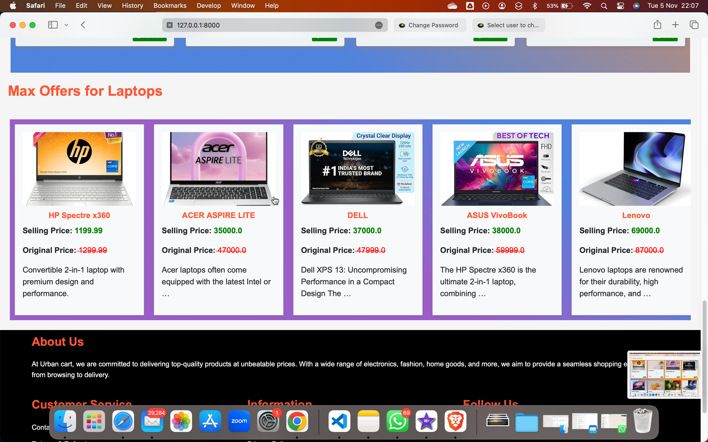
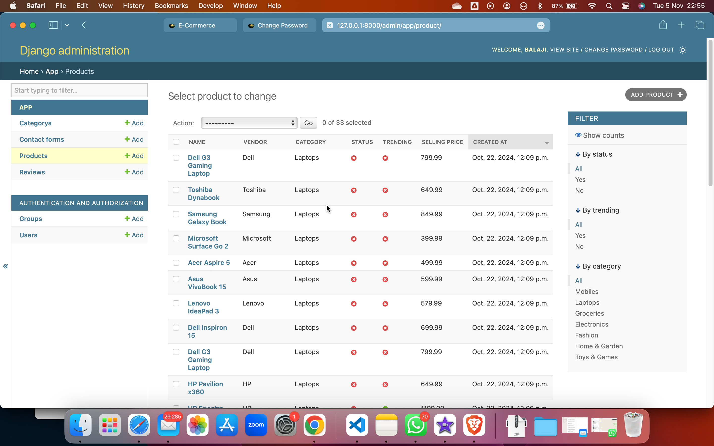

# E-Commerce Website

## Overview
A comprehensive e-commerce website developed using Django, providing functionalities for product management, user accounts, reviews, sentiment analysis, and more.

 <!-- Replace with the actual image path -->
 <!-- Replace with the actual image path -->
## Admin panel
 <!-- Replace with the actual image path -->
 <!-- Replace with the actual image path -->


## Features
- **User-Friendly Interface:** Designed for a seamless experience across devices.
- **User Account Management:** Implemented user account creation and account details changes, providing users with full control over their profiles.
- **Product Management:** Admin panel for easy management of products, including adding, editing, and categorizing items.
- **Inventory Tracking:** Admin has full control to track inventories and products.
- **Review System:** Users can submit reviews for products, complete with ratings and comments, subject to admin approval.
- **Sentiment Analysis:** Integrated sentiment analysis using Hugging Face's transformers to analyze product reviews, providing insights into customer feedback. Admins can view the overall sentiment and filter reviews based on sentiment scores.
- **Secure Authentication:** Implemented user authentication to ensure a safe and personalized shopping experience.
- **Complaint Contact Form:** Users can submit complaints or inquiries through a dedicated contact form.

## Technologies Used
- **Backend:** Django
- **Frontend:** HTML, CSS, Bootstrap
- **Database:** MySQL
- **Machine Learning:** Hugging Face Transformers for sentiment analysis

## Getting Started

### Prerequisites
Before you begin, ensure you have the following installed on your machine:
- **Python 3.x**
- **Django**: You can install Django using pip.
- **MySQL**: Make sure you have MySQL server running and accessible.

### Cloning the Repository
Follow these detailed steps to clone the repository:

1. **Open your terminal (Command Prompt, PowerShell, Git Bash, etc.).**
  
2. **Navigate to the directory where you want to clone the repository.**
   ```bash
   cd path/to/your/directory
